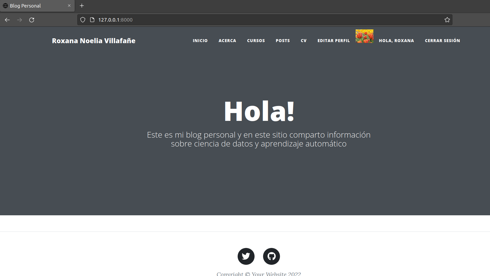

# Entrega Final Coderhouse - Programación con Python - Web similar a un blog. 

*Nombre: Villafañe, Roxana Noelia*

### Instalación

Instalación de Django

`$ python3 -m pip install Django`

Para correr el proyecto 

`$ python3 ./manage.py runserver`

Para realizar las migraciones

`$ python3 manage.py makemigrations`

`$ python3 manage.py migrate`

Para crear superusuario

`$ python3 manage.py createsuperuser`

### Vistas 

Para acceder al sitio 

Para acceder al sitio, la url correspondiente 

`http://127.0.0.1:8000`

### CRUD 

En este proyecto se realiza un CRUD completo de 
* Agregar cursos / Editar cursos / Eliminar cursos

Además los usuarios, pueden:
* Crear un usuario.
* Agregar un Avatar / Cambiar su Avatar / Eliminar su Avatar.

#### Unit Test

En este archivo se documentaron los casos de prueba. 
https://docs.google.com/spreadsheets/d/1Kd3zvgiM9fL4QOvMLeIf8TuyHeS4hNBh-751MWGWyzo/edit#gid=0 

#### Pendientes

* CRUD de agregar, editar, eliminar Posteos
* CRUD de agregar, editar, eliminar Mensajes a los Posteos
* Deploy en Heroku

## Video Presentación 

https://youtu.be/vhMOSTqv9oU 
